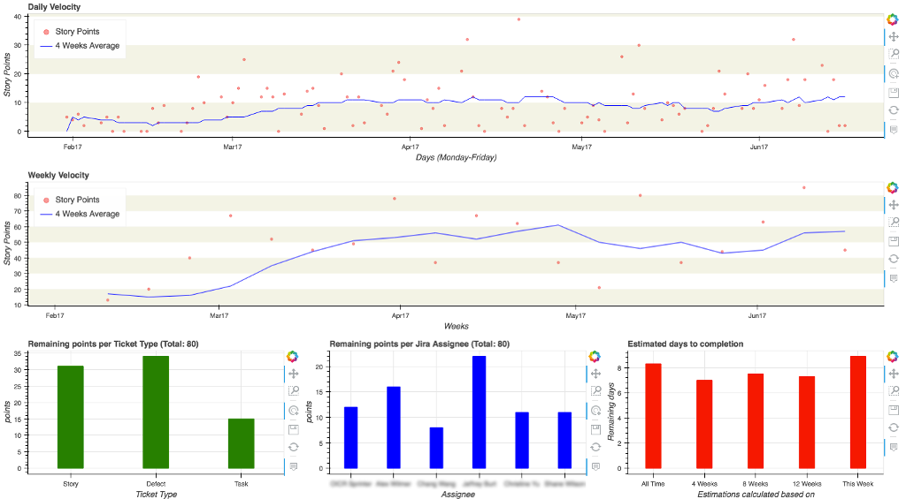
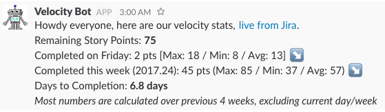

[](https://www.codacy.com/app/Gerthoffert/jira-agile-velocity?utm_source=github.com&amp;utm_medium=referral&amp;utm_content=Fgerthoffert/jira-agile-velocity&amp;utm_campaign=Badge_Grade)
[](https://travis-ci.org/Fgerthoffert/jira-agile-velocity)

Jira Agile Velocity (JAV)
==============================================================================

Built around [Cement](http://builtoncement.com/) This script has been created to look at historical data from Atlassian [JIRA REST API](https://developer.atlassian.com/jiradev/jira-apis/jira-rest-apis), calculate velocity, extract trends and estimate remaining work.

Velocity can be calculated using either story points (best) or ticket count (far from ideal). 

Charts, generated with [Bokeh](http://bokeh.pydata.org/en/latest/), can assist teams in identifying possible challenges, difficulties and the impact of various events. The resulting HTML page can then be automatically published to [github pages](https://pages.github.com/)



Daily statistics can be posted to slack to inform the team about progress.



Jav tries to be as friendly as possible with your Jira instance, it will progressively build a cache and only loads new or modified content from the REST API.

__Note__: This script is useful at identifying trends, how realistic a timeline is, but is by no means an accurate nor perfect way of planning.

# Installation

```bash
$ git clone git@github.com:Fgerthoffert/jira-agile-velocity.git
$ pip install -r requirements.txt
$ python setup.py install
```

# Configuration

In order to produce its statistics, JAV needs 2 [JQL Queries](https://confluence.atlassian.com/jirasoftwarecloud/advanced-searching-764478330.html), to calculate completed work and estimate remaining work.

## Ticket Completion (Velocity)

The script will collect those details day by day by looking at when tickets are transitioned in a particular state such as Closed or Completed. The script automatically append the date to the query and will loop until a data cache is built (with the end date configured during jav setup).

Sample Query:
```jql
project = "My Project" AND status changed to "Merged"
```

The script will automatically append a date to this query, for example "ON ('2017-02-23')"

## Remaining work

The script will then use a secon JQL query to identify the amount of work remaining for the team. In our particular case, all tickets in any open sprint but neither Merged nor Closed.


Sample Query:
```jql
sprint in openSprints() and project = "My Project" AND status not in (Merged, Closed)
```

# Setup

Once you identified (and tested in Jira) those 2 queries, it's time for you to configure jav, running its setup sub-command.

```bash
jav setup
```

The system will automatically prompt you to enter various configuration settings.

__WARNING__: JIRA credentials and slack webhook URLs are stored in clear text within the configuration file.

# Usage

To help in getting the system running, jav has been broken down in multiple sections, to prevent unneeded Slack spamming, the script is silent by default (only output messages to console), you need to manually tell it to send messages to slack.

```bash
jav --help
usage: jav [-h] [--debug] [--quiet] [-s] [-p PATH_CONFIG]
           {chart,clear,crunch,load,msg,publish,run,setup} ...

Connect to Jira REST API to collect completed story points, calculate weekly
velocity, and estimate completion date

optional arguments:
  -h, --help            show this help message and exit
  --debug               toggle debug output
  --quiet               suppress all output
  -s, --send            Send message to slack, by default prints to console
  -p PATH_CONFIG, --path PATH_CONFIG
                        Path to the directory storing data and config, will be
                        created if does not exist

sub-commands:
  {chart,clear,crunch,load,msg,publish,run,setup}
    chart               Create charts from cached data
    clear               Clear previous data (USE WITH CAUTION)
    crunch              Obtain updated data from Jira and crunch numbers
    load                Load latest data from Jira into cache
    msg                 Send latest stats to the team on Slack
    publish             Publish charts to github pages
    run                 Get data, crunch numbers, do stuff
    setup               Enter setup mode and provide configuration parameters
                        (jira creds, slack details)
```

If you issue the "run" sub-command, the system will execute the following actions:

* __load__: Run queries against JIRA to collect data
* __crunch__: Go through the data cache to extract statistics
* __chart__: Build Bokeh charts
* __publish__: Publish Bokeh charts to github pages
* __msg__: Send a message to Slack

Those actions can be executed independently, but obviously you need to follow a logical sequence during first execution (you can't generate charts if you don't download data and crunch it first).


# Contribute (dev)
```bash
$ virtualenv /path/to/myapp/env
$ source /path/to/myapp/env/bin/activate
$ pip install -r requirements.txt
$ python setup.py develop
```

Create/Update pip version
```bash
#1- update setup.py with new version number
# Remove previous builds
rm dist/*
python setup.py sdist
python setup.py bdist_wheel --universal
twine upload dist/*
```

# License

You can check out the full license [here](https://github.com/Fgerthoffert/jira-agile-velocity/blob/master/LICENSE).

This project is licensed under the terms of the GPLv3 license.