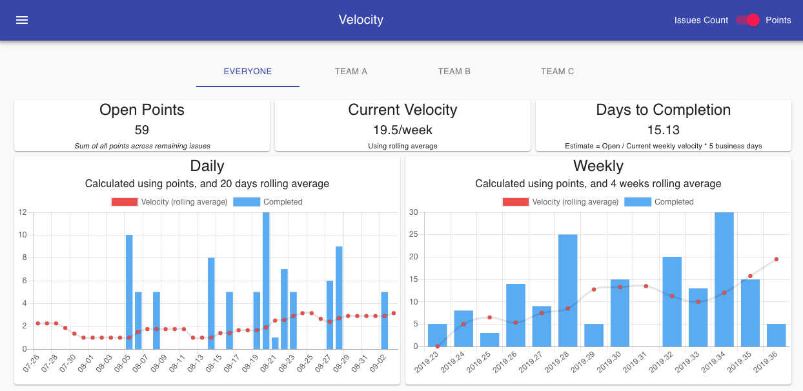
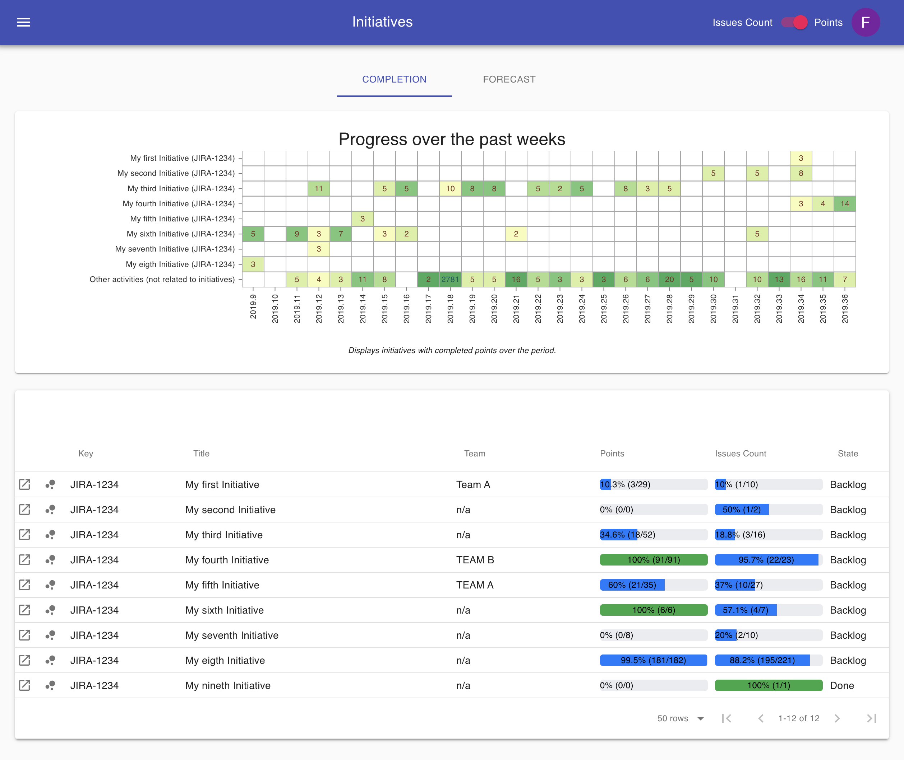
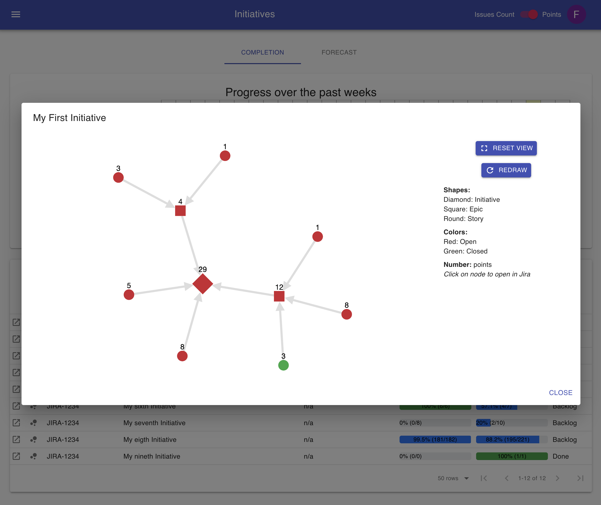
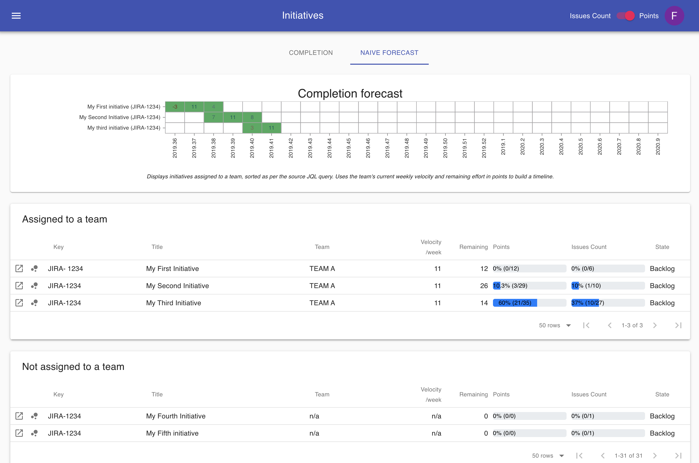

[](https://circleci.com/gh/Fgerthoffert/jira-agile-velocity/tree/master)

[](https://github.com/fgerthoffert/jira-agile-velocity/blob/master/package.json)
[](https://lgtm.com/projects/g/Fgerthoffert/jira-agile-velocity/alerts/)
[](https://lgtm.com/projects/g/Fgerthoffert/jira-agile-velocity/context:javascript)

| API                                                                           | UI                                                                          | CLI                                                                                                                                                                                                                                                                                              |
| ----------------------------------------------------------------------------- | --------------------------------------------------------------------------- | ------------------------------------------------------------------------------------------------------------------------------------------------------------------------------------------------------------------------------------------------------------------------------------------------ |
|  |  |  [](https://oclif.io) [](https://npmjs.org/package/jira-agile-velocity) |

<h1 align="center"> Jira Agile Velocity </h1><br>

<p align="center">
Builds various sets of Agile metrics and dashboards by fetching data from Jira REST API
</p>

<p align="center">
  <a href="https://github.com/fgerthoffert/jira-agile-velocity" target="_blank"></a>
</p>

## Table of Contents

- [Introduction](#introduction)
- [Features](#features)
- [Jira](#jira)
- [Authentication](#authentication)
- [Install](#install)

  <!-- tocstop -->

# Introduction

Jira's many, many features is a strength, but can also sometimes make it difficult to consume/visualize metrics. This (opinionated) tool was created to provide different (though simple) views into the data currently hosted within your Jira instance. It borrows concepts and code from [ZenCrepes](https://zencrepes.io) and applies it to Jira specificities.

The tool focuses on two main areas:

- Provide Agile teams with short-term velocity metrics (what did we just do, when will we be done with our backlog)
- Provide Program Management with a long-term vision throughout engineering activities (initiatives being worked on, progress & state, forecasting completion)

Jira-agile-velocity aims at being data-centric, leaving the interpretation to the user. The core concept used to derive metrics is simple: An activity has only two states, it either has to be done (remaining work), or it has been done. By specifying the appropriate JQL queries in the configuration, you can define what is considered done and what is considered remaining.

The tool is broken down in 3 codebases in a monorepo configuration, a UI, an API and a CLI (also called jira-agile-velocity on npm). The CLI's role is to fetch data, compute metrics, and generate a JSON payload, while the UI & API are only there to ease consumption of these metrics in a user-friendly manner.

At the moment, the tool is storing its data in json or ndjson files directly on the filesystem. It is sufficient for the current use case and there is no plan to use a database (i.e. MongoDB) on the short term. Instead, future evolutions will likely move closer to ZenCrepes' implementation, with a common (Github, Jira) indexer and all data served by a search-oriented datastore (i.e. Elasticsearch).

## Data-Centric

Although much smaller than ZenCrepes, the Jira Agile Velocity tool shares one its core principle: being data-centric and factual, it doesn't account (⚠️ ON PURPOSE ⚠️) for human interpretation.

An example? the Forecast feature provides a view over the coming weeks, but this view (on purpose) doesn't account for vacations or any other type of events that could impact the team's velocity, and it does not (and will not) provide features to include such events in its forecast. As a DM/PM/Scrum Master/Lead/... (pick one), you know your team and can, therefore, adjust estimates based on your experience.

# Features

This tool was built to provide a consolidated view over Jira issues and links back to Jira whenever possible. Most charts and elements are clickable, so you can easily open in Jira all issues closed by a team on a particular week, remaining issues in an initiative, ...

## Velocity view

The velocity view provides daily and weekly completion metrics as well as velocity calculated using a rolling average (4 weeks or 20 days), giving you general trend about a team's evolution. It can also be used to assess if stories are granular enough, by quickly highlighting if there is a recurring pattern of weeks with higher completion rate (i.e. most stories closed the last week of a sprint).

<p align="center">
  <a href="https://github.com/fgerthoffert/jira-agile-velocity" target="_blank"></a>
</p>

The view will also take a total of open points and, using the current velocity, provide an estimate in terms of days to completion, using a very simple formula:

```
Days to completion = Open points / current weekly velocity * 5 business days
```

As mentioned earlier, these are just factual elements, interpretation whether this estimate is realistic or not, is up to you.

Clicking on any of the bar-charts will open the corresponding issues in Jira.

## Initiatives view

The initiatives view is divided in two sections, one focused on past completion, the other one uses velocity to provide a naive forecast of a possible implementation schedule.

### Completion

<p align="center">
  
</p>

The initiatives completion view providers an overview over the past X weeks, of points (or issues count), completed per week for each initiatives by the teams. Displayed using a heatmap chart, a color scheme is used to highlight the proportion of the teams work (darker = higher proportion). The last line of the chart is an aggregate of all points (or count) completed but not related to an initiative.

The heatmap was designed to answer the following questions:

- Are the teams distracted from working on initiatives (last line with a high proportion of completed activities)?
- Are the initiatives properly scoped and receiving the correct focus?
- Are the initiatives prioritized properly?
- Are the teams consistent in their delivery of an initiative?

Hovering over the numbers displays the activities completed on that week for that initiative, clicking on it open those results in Jira.

Below the heatmap, a table provides the exact completion status of each initiative, with metrics in both Points and Issue Count, this view can answer the following questions:

- What's the completion progress?
- Who's working on those initiatives?
- Is there a lot of uncertainties in delivering an initiative? (for example if 90% of the points are completed, but only 20% of the issues)

The graph view provides a glance of all activities in an Initiative using a tree-like view. Numbers bubble-up for each generation of the tree. Hovering displays the corresponding ticket and clicking on it open it in Jira.

<p align="center">
  
</p>

### Naive Forecast

This view is centered around building a roadmap and was built to support the following use cases:

- Identify the amount of work remaining, per team.
- Provide a roadmap of the upcoming initiatives based on their effort and the team's velocity

<p align="center">
  
</p>

# Jira

The point of the tool is to provide a simple and data-centric view over your project management data, not to build an overly complex and highly customizable system. Trying to build a tool that could work on top of any workflows, without requiring the team to change any of its current Agile practices. But, for various reasons, it has not always been possible and there are occurrences where the tool is going slightly over what I would have hoped in terms of the need for Jira customization.

The field **jqlHistory**, uses the format YYYY-MM-DD and defines how far back in history to fetch data from Jira. This might make the first execution slow (initial data fetch), but subsequent will only fetch new days, which will be much faster.

## Map Jira fields

Most of the configuration settings should be fairly straight forward (username, host, ...), what might be slightly more challenging though is to identify the various ID for some of Jira fields (points, epics, ...), which will be different from one installation to the next.

There are many resources online providing instructions to do so, and I'd recommend [checking some of them](https://confluence.atlassian.com/jirakb/how-to-find-id-for-custom-field-s-744522503.html)

Some of the fields are pre-installed by Jira Portfolio, but using a custom field of the same type should provide you with a similar feature.

The following fields are used:

| Name                  | Type             | Description                                                                                                                                                                                                                            |
| --------------------- | ---------------- | -------------------------------------------------------------------------------------------------------------------------------------------------------------------------------------------------------------------------------------- |
| Story Points          | number (or null) | This field is used to calculate the velocity                                                                                                                                                                                           |
| Original Story Points | number (or null) | TThis field is used to calculate velocity in the absence of story points, typically this field is used by the team to provide a high-level estimate when planning an entire feature before actually breaking it down in smaller chunks |
| Parent Initiative     | string (or null) | Attach a ticket (child) to an initiative (parent), this string is the ticket key (JIRA-1234)                                                                                                                                           |
| Parent Epic           | string (or null) | Attach a ticket (child) to an epic (parent), this string is the ticket key (JIRA-1234)                                                                                                                                                 |

## Team user and group

This is one of the elements having an impact on a team's workflow I would have liked to avoid, but creating a dedicated user per team is probably the best option to address some of the challenges with handling the data.

Imagine all of your teams are sharing projects (which is a very typical scenario), you need a way to identify work completed by a team, versus work completed by another one. You can easily achieve this by creating one user group per team and assigning all of your team members to the corresponding group. In that particular case, your JQL queries can be filtered using `assignee in membersOf("YOUR-TEAM-GROUP")`.

Then you also need to identify remaining work assigned to your team, but in the typical Agile fashion, your tickets are likely only assigned to team members when being picked-up just before starting to work on them. What about the rest of your team's sprint (or team backlog)? You could use the sprint name, but this would force a specific format and require some error-prone string parsing (sprints are only defined by their name, you can't attach a sprint to a team for example).

The only "not-too-intrusive" solution I found is to actually create a dedicated user for the team, attach this user to your team group, and assign it your backlog/sprint tickets (you could give it a funny name, I like to call those users "sprinters", like "Team A sprinter"). Then, once the team members begin implementation they'd assign the ticket to them as they would otherwise.

There needs to be a match between this team user' username (the display name can be different) and the actual team name you define in the tool's configuration. For its internal processing, the tool will always use an ID derived from both the team's name in the configuration file and the team's username in Jira. The ID is generated by stripping all non-alphanumerical characters and converting the resulting string to lowercase.

```
export const getTeamId = (teamName: string) => {
  return String(teamName)
    .replace(/[^a-z0-9+]+/gi, '')
    .toLowerCase();
};
```

| Configuration file | Jira Username | Jira Display name | Internal Team ID |
| ------------------ | ------------- | ----------------- | ---------------- |
| Agile Team A       | agile-team-a  | Team A Sprinter   | agileteama       |
| Team London        | team-london   | The Sprinters     | teamlondon       |

Hopefully that makes sense.

## Daily Completion

Jira doesn't have a key concept of completion directly attached to an issue. It does have a `created date`, and `updated date`, but it doesn't have the notion of `closed date` or `completed date` in its data model.

As a result, the tool fetches completion data daily by using the date a transition happened, and this has to be built within your query. For example, the tool will run queries such as `assignee in membersOf("agile-team") AND status changed to Done ON ('2019-08-01')` to fetch all tickets that were completed on a August 1st 2019.

When configuring `jqlCompletion`, do the following:

- Build your query for a date of your choice, and test it in Jira issues search
- Be sure to have the transition (for example `AND status changed to Done ON ('2019-08-01')`) to be the last statement of your query
- Copy the full query into `jqlCompletion` but remove `ON ('YYYY-MM-DD')` since this part of the query will be automatically added.

Example of valid queries for the `jqlCompletion` field:

- `assignee in membersOf("agile-team") AND status changed to Done`
- `project = "My-tool" AND status changed to Closed`
- `type = "Story" and status changed to Reviewed`

## Remaining work

Defining remaining work is pretty straight-forward, the following are valid queries to be used for `jqlRemaining`:

- `assignee in membersOf("agile-team") AND sprint in openSprints()`
- `project = "My-tool" AND status != Closed`
- `type = "Story" and status != Reviewed`

# Authentication

When configuring the tool you can choose between anonymous access (no authentication nor authorization) or using [Auth0](https://auth0.com) as an authentication/authorization provider.

The tool ships with a default Auth0 configuration good enough to get started for development purposes (⚠️do not use those for production ⚠️). It will just validate that users are properly authenticated to Google.

## Anonymous access

Anonymous access is done by bypassing the authentication layer entirely. If Auth0 is disabled, all requests to the API will be accepted and the UI will not display the login views. Don't worry though, your source data and configuration settings are still safe, the API is only exposing the consolidated payloads for velocity and initiatives.

## Auth0 access (Authenticated and authorized)

Access to the tool's UI and API can be secured using [Auth0](https://auth0.com) as an authentication and authorization provider.

The power of using a provider such as Auth0 (versus directly integrating with Google OAuth2 for example) is that it already provides a robust authorization logic (some might say it's not a good thing), removing the need for building such logic within our tool. Auth0 can then be configured to allow only a pre-defined list of users, an entire domain, ... with a scripting language to define and configure the authorization logic (see the Rules section in your Auth0 dashboard). Pretty powerful and easy to setup.

### Create an Auth0 application

You will first need to create a "Single Page Application" in the Applications menu, in the settings of your application:

- **Domain** is the Auth0 domain, you need to set `AUTH0_DOMAIN` to that value
- **Client ID** is used for the UI, you need to set `AUTH0_CLIENT_ID` to that value
- **Allowed Callback URLs** is the address users are redirected to after log-in, set this value to the domain you are using for the tool's front-end (it could be something like `http://localhost:3000/` for dev or testing)
- **Allowed Web Origins** set this value to the domain you are using for the tool's front-end (it could be something like `http://localhost:3000/` for dev or testing)
- **Allowed Logout URLs** this is the address users would be redirected to after logging-out, set this value to the domain you are using for the tool's front-end (it could be something like `http://localhost:3000/` for dev or testing)

### Create an Auth0 API

Then go and create an API in the configuration panel.

- **Identifier**, should be the same value than what is being setup for `AUTH0_DOMAIN` in the UI. You can use your API URL there.

Those settings (`AUTH0_DOMAIN`, `AUTH0_CLIENT_ID`) are to be set in your docker-compose.yml file.

# Install

## Docker and docker-compose

All three components have been dockerized and can be easily spun-up using docker-compose. This is the recommended setup to get everything running quickly.

During the first startup, the system will initialize a configuration file (`config.yml`) in your `device` folder, this will need to be updated with the desired settings before re-starting the container. Once updated, you can either re-start the environment `docker-compose down; docker-compose up` or manually trigger a data refresh in the cli container.

### docker-compose.yml

You can use the docker-compose file below to spin-up the environment, the only required action is to create a directory on the Docker host's filesystem to host the configuration file and the application cache.

```yaml
version: '3.7'

volumes:
  data-volume:
    driver: local
    driver_opts:
      type: none
      device: /tmp/jav-data
      o: bind

services:
  jav-cli:
    image: fgerthoffert/jav-cli:latest
    environment:
      - 'CONFIG_DIR=/root/jav-data'
    volumes:
      - data-volume:/root/jav-data

  jav-api:
    image: fgerthoffert/jav-api:latest
    ports:
      - '5001:3001'
    environment:
      - 'CONFIG_PATH=/root/jav-data'
      - 'AUTH0_DISABLED=true'
      - 'AUTH0_DOMAIN=agile-jav.auth0.com'
      - 'AUTH0_AUDIENCE=http://localhost:5001'
    volumes:
      - data-volume:/root/jav-data

  jav-ui:
    image: fgerthoffert/jav-ui:latest
    ports:
      - '5000:80'
    environment:
      - 'API_URL=http://127.0.0.1:5001'
      - 'AUTH0_DISABLED=true'
      - 'AUTH0_DOMAIN=agile-jav.auth0.com'
      - 'AUTH0_CLIENT_ID=sGJDsqzc0VhKgoutaoyLWjyWK9kAwE2f'
      - 'AUTH0_AUDIENCE=http://localhost:5001'
```

Once the directory is created, you can start the environment:

```bash
> mkdir /tmp/jav-data # Replace with the desired directory to store cache and config on host
> docker-compose pull # Fetches the latest version of the containers
> docker-compose up -d # Run the containers in deamon mode (you can remove -d to see log messages)
```

#### Specific Windows configuration

On Windows, the configuration file below has to be used and two additional steps are needed.
- Step 1: Select the local drive to be shared (see https://docs.docker.com/docker-for-windows/#shared-drives)
- Step 2: Enable the paths conversion typing the following command line `set COMPOSE_CONVERT_WINDOWS_PATHS=1` (see https://docs.docker.com/compose/reference/envvars/#compose_convert_windows_paths)

```yaml
version: '3.7'

services:
  jav-cli:
    image: fgerthoffert/jav-cli:latest
    environment:
      - 'CONFIG_DIR=/root/jav-data'
    volumes:
      - type: bind
        source: c:/docker-tmp
        target: /root/jav-data

  jav-api:
    image: fgerthoffert/jav-api:latest
    ports:
      - '5001:3001'
    environment:
      - 'CONFIG_PATH=/root/jav-data'
      - 'AUTH0_DISABLED=true'
      - 'AUTH0_DOMAIN=agile-jav.auth0.com'
      - 'AUTH0_AUDIENCE=http://localhost:5001'
    volumes:
      - type: bind
        source: c:/docker-tmp
        target: /root/jav-data

  jav-ui:
    image: fgerthoffert/jav-ui:latest
    ports:
      - '5000:80'
    environment:
      - 'API_URL=http://127.0.0.1:5001'
      - 'AUTH0_DISABLED=true'
      - 'AUTH0_DOMAIN=agile-jav.auth0.com'
      - 'AUTH0_CLIENT_ID=sGJDsqzc0VhKgoutaoyLWjyWK9kAwE2f'
      - 'AUTH0_AUDIENCE=http://localhost:5001'
```

Note: The cli container is not configured with a cron to refresh data, you'd need to configure this on your host environment (see configuration update below)

### Configuration update

To refresh or manually load data, you can run a command directly towards the CLI docker containing using the following command:

```bash
> docker exec -it jira-agile-velocity_jav-cli_1 /usr/share/jav/startup.sh
```

Replace the container name (jira-agile-velocity_jav-cli_1) with the actual name for the CLI container obtained by executing `docker ps`.

### Access the UI

In its current Docker configuration, the UI is accessible through `http://127.0.0.1:5000` (or the port configured for jav-ui). It is strongly recommended to configure a reverse proxy (with nginx for example) serving those resources (UI and API) over HTTPS. But this is considered out of scope of this tool.

## Development environment setup

If you are familiar with npm, running the application in development mode should be very straight forward.

```bash
> git clone https://github.com/Fgerthoffert/jira-agile-velocity.git
> cd jira-agile-velocity
> cd api
> npm install
> cd ..
> cd ui
> npm install
> cd cli
> npm install
> cd ..
```

You can now run each application in their own terminal.

### CLI

```bash
> cd cli
> ./bin/run velocity # Update the velocity metrics
> ./bin/run roadmap # Update the velocity roadmap
```

### API

You should be passing environment variable when starting the API (see example below)

```bash
> cd api
> AUTH0_DOMAIN=agile-jav.auth0.com  AUTH0_AUDIENCE=http://localhost:3001 npm run start:dev
```

The following variables are used:

- CONFIG_PATH : Path on the filesystem containing the configuration file and data cache directory
- AUTH0_DISABLED : To enable or disable authentification
- AUTH0_DOMAIN : The Auth0 Domain
- AUTH0_AUDIENCE": The Auth0 audience

### UI

When developing with the UI, you can update environment variables by editing the `.env` file in the UI folder

```bash
> cd api
> npm run dev
```

## Build workflow

The project's repository is linked to circle-ci for ci/cd.

### On Commit

A set of basic checks are executed on every commit, these include linting and, for the CLI app, running a set of minimal commands (used to verify that the app is executable). At a later stage, unit tests might be added (the frameworks are configured to support tests, it's just a matter of spending the time to write them).

### On Tag creation

A set of more interesting actions happen when a new tag is created:

- A new version of the CLI component is pushed to the NPM registry (npmjs.org) using GitHub's release version. Once pushed, another job install that package in a containing and run a series of simple checks (the same than for commits), to verify the app, once installed globally, is usable.
- New docker containers, for all 3 components, are created and pushed to docker hub
